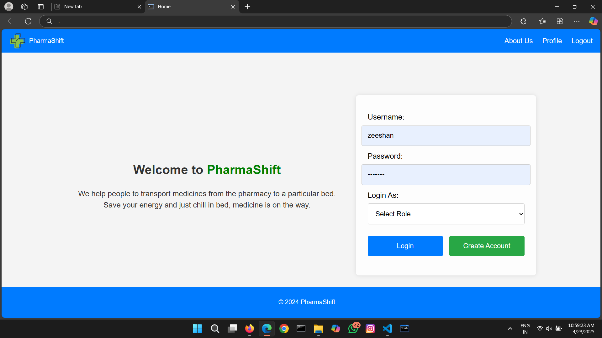
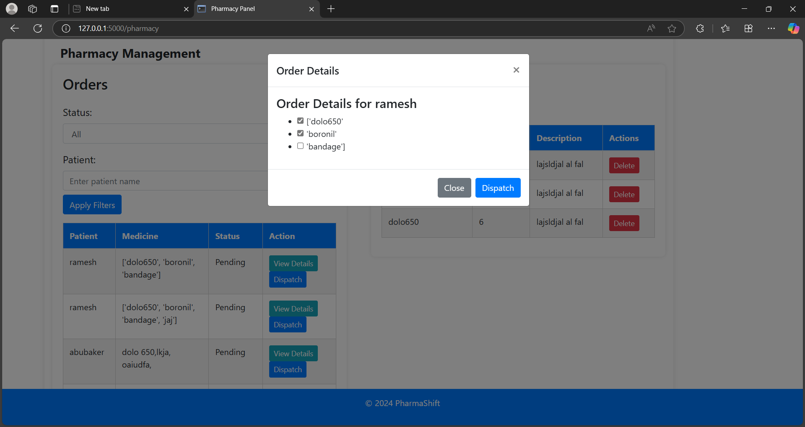
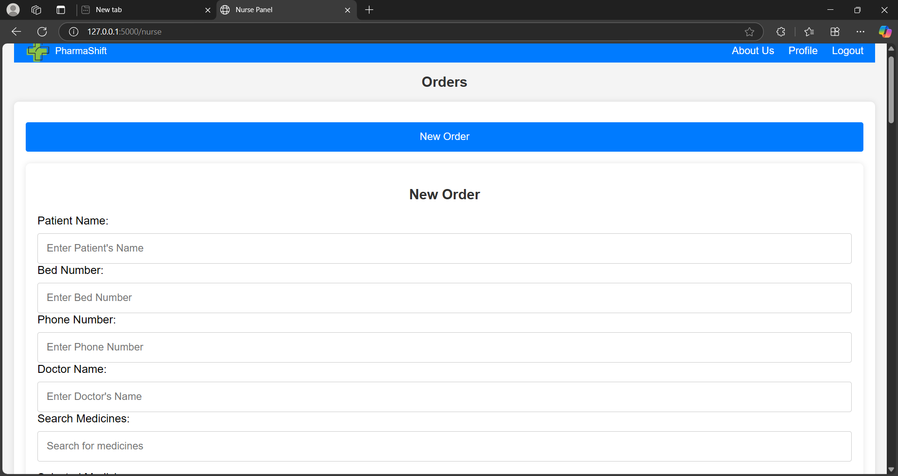
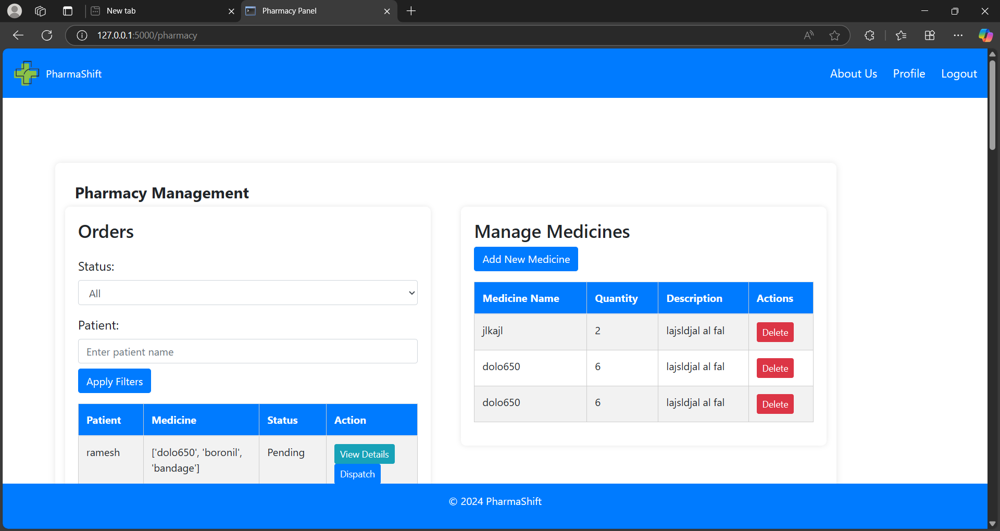
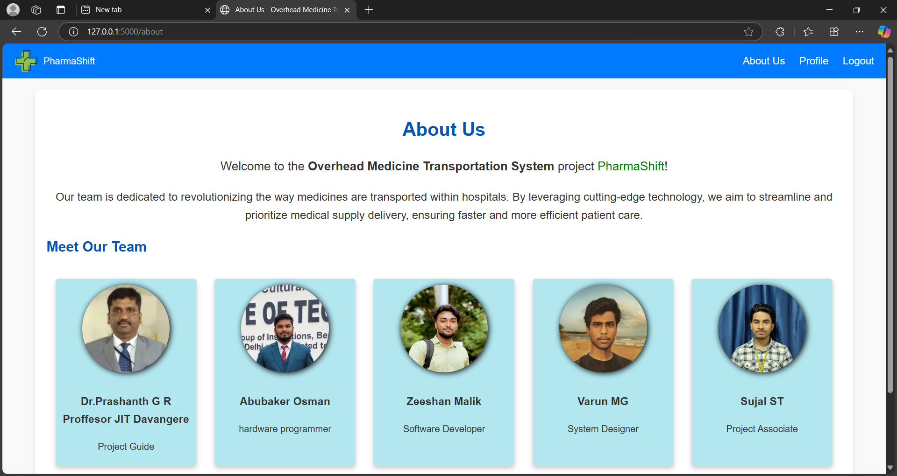
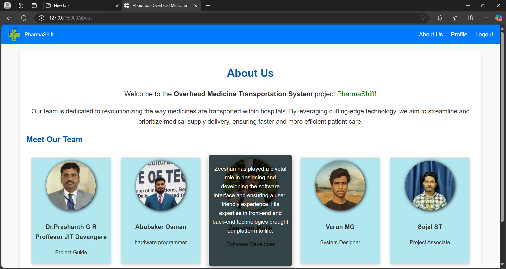

# 🚑 PharmaShift: Overhead Track System for Medicine Transportation

PharmaShift is a smart, automated overhead track system designed for efficient and hygienic medicine delivery in hospitals. This system reduces human intervention, minimizes errors, and ensures fast, contactless transportation of medicines from the pharmacy to various hospital wards.

---

## 📌 Table of Contents

- [Overview](#-overview)
- [Features](#-features)
- [Technologies Used](#-technologies-used)
- [System Architecture](#-system-architecture)
- [Installation](#-installation)
- [Usage](#-usage)
- [Screenshots](#-screenshots)
- [Project Demonstration](#-project-demonstration)
- [Contributors](#-contributors)
- [License](#-license)

---

## 🔍 Overview

PharmaShift addresses the need for efficient intrahospital medicine delivery. It utilizes a microcontroller-controlled capsule that moves along an overhead track, delivering medicines to target rooms autonomously or manually.

---

## ✨ Features

- Motorized capsule unit for medicine delivery  
- Remote and auto operational modes  
- Sensor-based delivery confirmation system  
- Easy-to-use interface for pharmacy staff  
- Lightweight and modular design  
- Reduces delivery time and manual labor  

---

## 🛠 Technologies Used

- Arduino/ESP32 Microcontroller  
- IR/Ultrasonic Sensors  
- Servo/DC Motors  
- Embedded C / C++  
- HTML, CSS, JavaScript (for interface)  
- Mechanical Design & Track System  

---

## 🏗 System Architecture

```plaintext
[Pharmacy Module] --> [Overhead Track] --> [Capsule Unit] --> [Target Ward/Room]

          |                         |
     Microcontroller           Sensors
          |                         |
  Remote Control / App     Stop Mechanism

```
---

## ⚙️ Installation

    Note: This is a hardware-integrated project. The following steps are for the code and simulation setup.

    Clone the repository:

    git clone https://github.com/your-username/PharmaShift.git

    Open the code in Arduino IDE or VS Code with PlatformIO.

    Connect your microcontroller (Arduino/ESP32).

    Upload the firmware to the board.

    Power on the circuit and test the capsule movement.

▶️ Usage

    Manual Mode: Press the control button to operate the capsule manually.

    Auto Mode: The capsule moves based on programmed delivery routes.

    Delivery Confirmation: Sensors trigger a beep or signal upon reaching the destination.

📸 Screenshots


🔐 Login Page


📦 Order Management Page


📦 Order Management Page


📦 Order Management Page


🏥 Pharmacy Dashboard


ℹ️ About Us - Page 1


ℹ️ About Us - Page 1



📹 Project Demonstration

    A video demonstration of the working prototype is available at the link below:

🎬 Watch Demo Video
👨‍💻 Contributors

    Zeeshan Malik – System Designer & Hardware Integrator

    Sujal ST – Interface Software Developer

    Abubaker Osman – Hardware Engineer

    Varun MG – Associate Developer

    

📜 License

This project is for educational purposes only.
